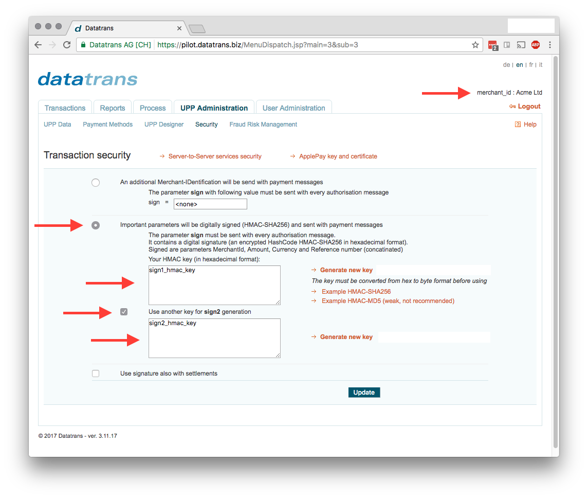

# DatatransHelper

[](https://raw.githubusercontent.com/jshmrtn/datatrans-helper/master/LICENSE)
[](https://travis-ci.org/jshmrtn/datatrans-helper)
[](https://hex.pm/packages/datatrans_helper)
[](https://inch-ci.org/github/jshmrtn/datatrans-helper)
[](https://coveralls.io/github/jshmrtn/datatrans-helper?branch=master)

Small Helper Library to sign / validate Datatrans requests.

## Installation

The package can be installed
by adding `datatrans_helper` to your list of dependencies in `mix.exs`:

```elixir
def deps do
  [{:datatrans_helper, "~> 0.2.0"}]
end
```

## Configuration

```elixir
config :datatrans_helper,
  merchant_id: "Some ID",
  sign1_hmac_key: "Some Key",
  sign2_hmac_key: "Some Key"
```



## Documentation

The docs can be found at [https://hexdocs.pm/datatrans_helper](https://hexdocs.pm/datatrans_helper).
